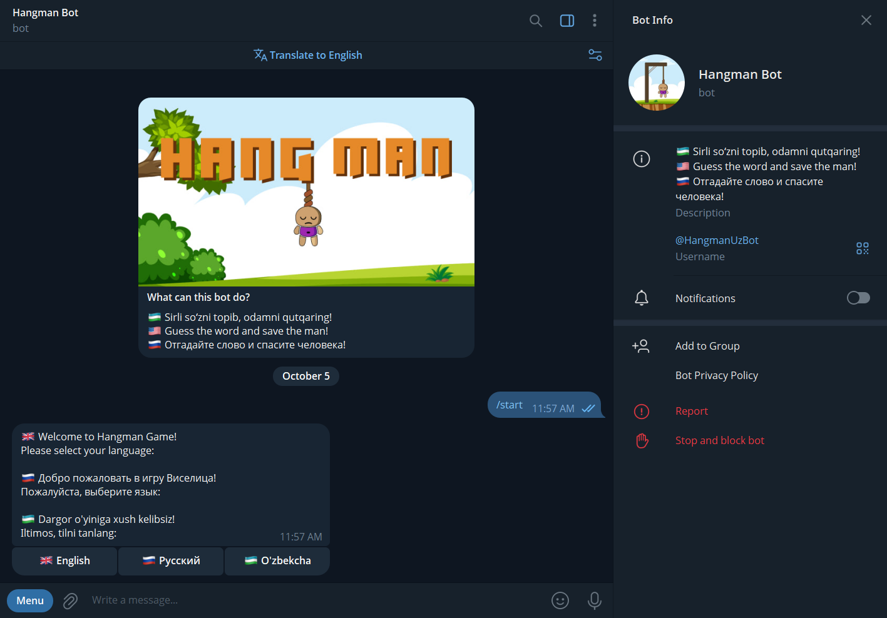

# Hangman Telegram Bot

A fun Telegram bot implementation of the classic Hangman game using aiogram.



## Features

- 🌏 **Multilingual Support**: Full interface in 3 languages (English, Russian, Uzbek)
- 🎮 **Classic Hangman Gameplay**: Guess the word letter by letter
- 🖼️ **Visual Progression**: 8 hangman images showing your progress
- ⌨️ **Language-Specific Keyboards**:
  - English: A-Z alphabet (26 letters)
  - Russian: Cyrillic alphabet (33 letters)
  - Uzbek: Latin-based alphabet with `'` sign (26+1)
- 📚 **CSV Word Database**: Organized words with categories for each language
- 🎯 **Category Display**: See the category of the word you're guessing
- 🔤 **Interactive Word Display**: Word letters shown as inline buttons
- 🎭 **Session Management**: Clean message history for better UX
- 💀 **Progressive Difficulty**: 7 wrong guesses before game over

## Setup

1. **Install dependencies:**
   ```bash
   pip install -r requirements.txt
   ```

2. **Configure your bot token:**
   - Create a bot using [@BotFather](https://t.me/botfather) on Telegram
   - Copy the bot token
   - Create a `.env` file in the project root and add your token:
    ```
    BOT_TOKEN=your_bot_token_here
    ```
    Example is given in `.env.example` file.

3. **Prepare word files** (optional):
   - The bot comes with pre-configured word files:
        - `words-en.csv`,
        - `words-ru.csv`,
        - `words-uz.csv`
   - You can add your own words in the format: `word,category`
   - Each file should contain words in the respective language

4. **Run the bot:**
   ```bash
   python hangman-bot.py
   ```

## How to Play

1. **Start the bot**: Send `/start` to your bot on Telegram
2. **Select language**: Choose your preferred language (English, Russian, or Uzbek)
   - This sets both the interface language and the language of words to guess
3. **Start a game**: Click the "▶️ Play" button or send `/play`
4. **Guess letters**: Tap letters from the on-screen keyboard
   - The word is displayed as inline buttons (revealed letters or *)
   - Wrong guesses are tracked and shown
   - The hangman image updates with each wrong guess
5. **Win or lose**: Guess all letters before 7 wrong attempts to win!
6. **End game early**: Tap the 🚫 button to stop the current game
7. **Change language**: Use the "🌐 Change Language" button to switch languages

## Commands

- `/start` - Welcome message and language selection (first time) or main menu
- `/play` - Start a new game with words in your selected language
- `/help` - Show detailed help and game instructions
- `/stop` - Stop the current game and reveal the word

## Keyboard Layouts

### English (26 letters + apostrophe + END)
- Row 1: A B C D E F G
- Row 2: H I J K L M N
- Row 3: O P Q R S T U
- Row 4: V W X Y Z ' 🚫

### Russian (33 Cyrillic letters + apostrophe + END)
- Row 1 (9): А Б В Г Д Е Ё Ж З
- Row 2 (9): И Й К Л М Н О П Р
- Row 3 (9): С Т У Ф Х Ц Ч Ш Щ
- Row 4 (7+1): Ъ Ы Ь Э Ю Я ' 🚫

### Uzbek (Latin-based with special characters)
- Row 1: A B C D E F G
- Row 2: H I J K L M N
- Row 3: O P Q R S T U
- Row 4: V W X Y Z ' 🚫

## Game Rules

- You have **7 wrong guesses** before the game ends
- Each wrong guess progresses the hangman image
- Guessed letters are tracked and displayed
- Win by guessing all letters correctly before running out of attempts
- Words are selected randomly from the language-specific CSV file
- Each word has an associated category shown during gameplay

## Image Progression

The bot uses 8 images to show the hangman progression:
1. `blank.png` - Starting state
2. `head.png` - After 1 wrong guess
3. `head-torso.png` - After 2 wrong guesses
4. `h-t-lh.png` - After 3 wrong guesses
5. `h-t-hands-lf.png` - After 4 wrong guesses
6. `h-t-hands.png` - After 5 wrong guesses
7. `fresh-man.png` - After 6 wrong guesses
8. `died-man.png` - Game Over (7 wrong guesses)

## Project Structure

```
hangman-bot/
├── hangman-bot.py      # Main bot code
├── .env                # Bot token configuration (create this)
├── requirements.txt    # Python dependencies
├── README.md          # This file
├── words-en.csv       # English words database
├── words-ru.csv       # Russian words database
├── words-uz.csv       # Uzbek words database
└── images/            # Hangman progression images
    ├── blank.png
    ├── head.png
    ├── head-torso.png
    ├── h-t-lh.png
    ├── h-t-hands-lf.png
    ├── h-t-hands.png
    ├── fresh-man.png
    └── died-man.png
```

## CSV Word File Format

Each language has its own CSV file with the following format:

```csv
word,category
PYTHON,Programming
TELEGRAM,Technology
COMPUTER,Technology
```

- **Header row**: `word,category`
- **Data rows**: One word per line with its category
- **Words**: Should be in UPPERCASE
- **Encoding**: UTF-8 (important for Cyrillic and special characters)

## Technologies Used

- **Python 3.x**
- **aiogram 3.13.1** - Modern async Telegram Bot API framework
- **python-dotenv 1.0.1** - Environment variable management
- **CSV module** - Word database management
- **FSM (Finite State Machine)** - Game state management
- **Inline & Reply Keyboards** - Interactive UI elements

## License

Free to use and modify for personal and educational purposes.
